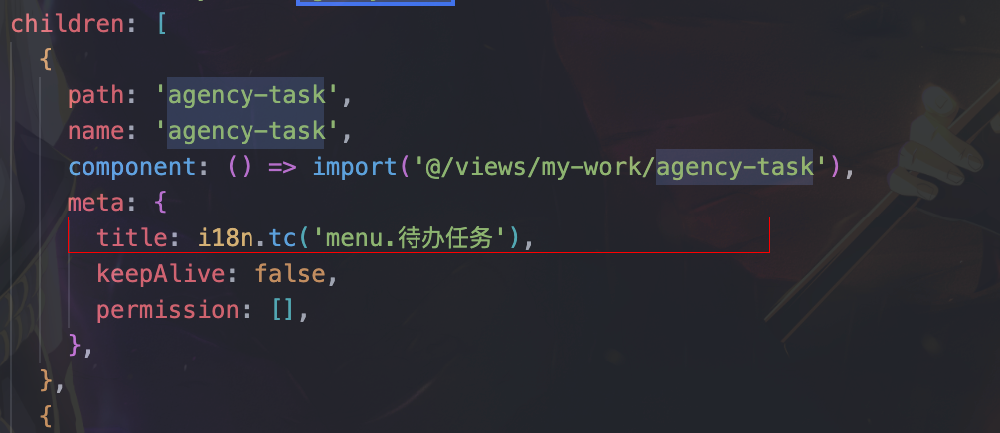
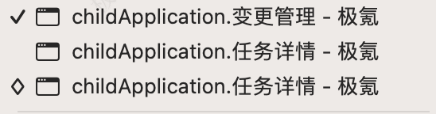

### 子应用多页签多语言问题

老的多页签多语言实现方式：

在新代办改造过程中。因为新代办列表拆出，使用子应用的形式接入。而子路由的路由是动态加载的。导致原来配置的路由信息的多语言失效

而已知路由元信息是静态的。不能随意改变。那么进入子应用的页面的时候，我们怎么去配置呢？这是一个共性问题。不单单是新待办改造引起的。而是子应用接入，只要涉及多语言都会有相同的问题。

首先因为临近上线时间：当时想到的是实在router.beforeEach钩子函数中。判断当前是否子应用以及代办。这样当然也可以实现。但是这样写的判断要很多。

后来想到。因为动态加载了子应用路由。可以从那入手

这样就解决了子应用的路由问题。虽然这解决了子应用的多语言问题，但是，由于我们系统并不是每个页面都需要多语言。导致其余子应用就会出现以下情况。

在多语言方法中加入

